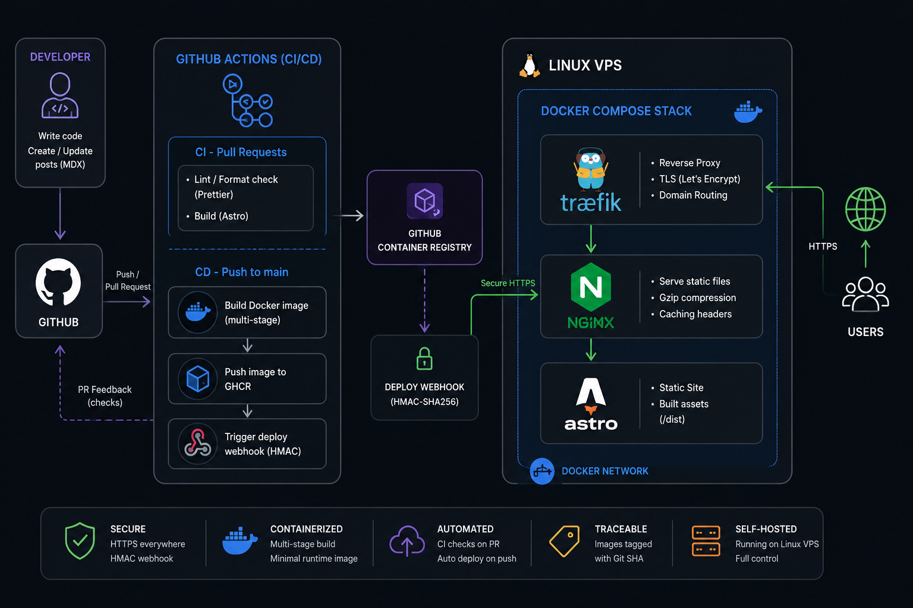

# Portfolio & Technical Blog

Personal portfolio built with **Astro, TypeScript and Docker**, deployed to a **self-hosted Linux VPS** through a GitHub Actions CI/CD pipeline.

The project focuses on **containerization, reverse proxying, automated deployments, networking and production infrastructure**.

🌐 **[caixeta.dev](https://caixeta.dev)**

---

## Architecture



The application runs on a self-hosted Linux VPS behind **Cloudflare**, with **Traefik** handling reverse proxying and TLS, and **Nginx** serving the generated Astro application.

### Network Flow

```text
Internet
    │
    ▼
┌──────────────┐
│  Cloudflare  │
│              │
│ DNS / Proxy  │
│ Bot Defense  │
│ DDoS         │
└──────┬───────┘
       │
       │ HTTPS
       ▼
┌──────────────────── VPS ────────────────────┐
│                                             │
│                 Traefik                     │
│          Reverse Proxy / TLS                │
│                     │                       │
│                     ▼                       │
│                  Nginx                      │
│                     │                       │
│                     ▼                       │
│              Astro Static Site              │
│                                             │
└─────────────────────────────────────────────┘
```

Cloudflare is used as the public edge layer, keeping the VPS origin IP hidden from normal visitors and providing an additional security layer in front of the infrastructure.

Traffic is routed through Cloudflare before reaching Traefik on the VPS.

This provides:

* **Origin IP protection** through Cloudflare's proxy
* **DDoS protection**
* **Bot protection and filtering**
* **DNS management**
* **HTTPS/TLS at the edge**
* **Reverse proxying** through Traefik
* A separation between the public edge and the application infrastructure

---

## Production Infrastructure

The production environment is composed of:

* **Cloudflare** — DNS, proxy, edge security and bot protection
* **Linux VPS** — self-hosted production environment
* **Docker & Docker Compose** — application packaging and orchestration
* **Traefik** — reverse proxy, routing and TLS
* **Nginx** — static file serving, compression and caching
* **Let's Encrypt** — TLS certificates
* **GitHub Container Registry** — Docker image registry

The application uses a **multi-stage Docker build**:

```text
Node.js
   │
   ├── Install dependencies
   └── Build Astro application
            │
            ▼
         /dist
            │
            ▼
      Nginx Alpine
            │
            ▼
      Production Container
```

Node.js and the build tooling are not included in the final runtime image.

---

## CI/CD

The deployment pipeline is fully automated with **GitHub Actions**.

### Pull Requests

```text
Pull Request
     │
     ├── Prettier check
     └── Astro production build
```

### Production Deployment

```text
Push to main
     │
     ▼
GitHub Actions
     │
     ├── Run CI checks
     ├── Build Docker image
     ├── Push image to GHCR
     └── Trigger authenticated webhook
                    │
                    ▼
                   VPS
                    │
             Docker Compose
                    │
                    ▼
             New application
```

Images are tagged with the **Git commit SHA**, allowing each production deployment to reference an immutable version.

The deployment webhook is protected with **HMAC-SHA256 authentication**, so only authorized requests can trigger a deployment.

---

## Blog & Content

The portfolio also includes a technical blog built with **MDX** and Astro Content Collections.

Posts are version-controlled alongside the application:

```text
src/posts/
├── lsof-command-tutorial.mdx
├── how-inode-works.mdx
├── ssh-config.mdx
└── ...
```

Content is statically generated during the Astro build, so the production environment does not require a database or application server.

This gives the blog a simple Git-based publishing workflow:

```text
MDX → Git → CI → Build → Docker → Production
```

---

## Tech Stack

| Area            | Technologies                                 |
| --------------- | -------------------------------------------- |
| Application     | Astro, TypeScript, React, MDX, Tailwind CSS  |
| Edge / Security | Cloudflare, DNS Proxy, DDoS & Bot Protection |
| Infrastructure  | Linux, VPS, Docker, Docker Compose           |
| Networking      | Traefik, Nginx, HTTPS, Let's Encrypt         |
| CI/CD           | GitHub Actions, GHCR, Docker Buildx          |
| Security        | HMAC-SHA256 deployment authentication        |
| Content         | Astro Content Collections, MDX               |

---

## Key Engineering Practices

* **Self-hosted production environment** running on a Linux VPS
* **Cloudflare as the public edge layer**, hiding the origin IP and filtering malicious/bot traffic
* **Multi-stage Docker builds** with a minimal runtime image
* **Automated CI/CD** with GitHub Actions
* **Immutable deployments** using Git commit SHA image tags
* **Authenticated deployment webhook** protected with HMAC-SHA256
* **Reverse proxy and TLS** with Traefik
* **Static content delivery** through Nginx
* **Git-based content management** for the technical blog

---

## Local Development

```bash
corepack enable
pnpm install
pnpm dev
```

Build for production:

```bash
pnpm build
```
