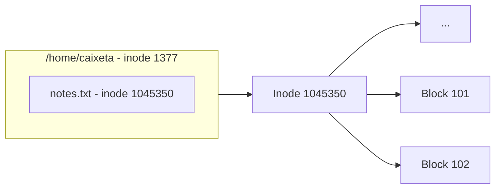
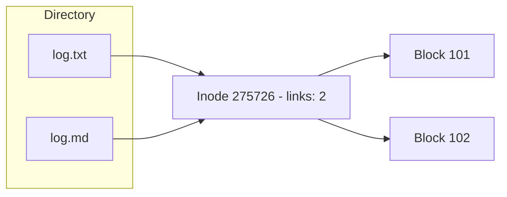
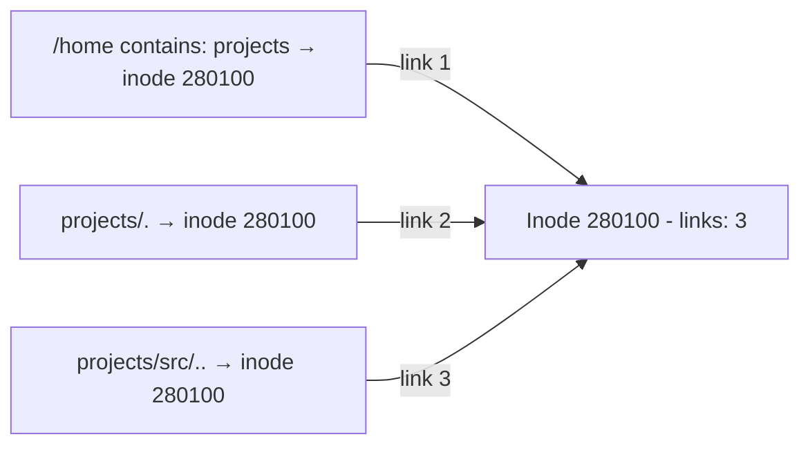
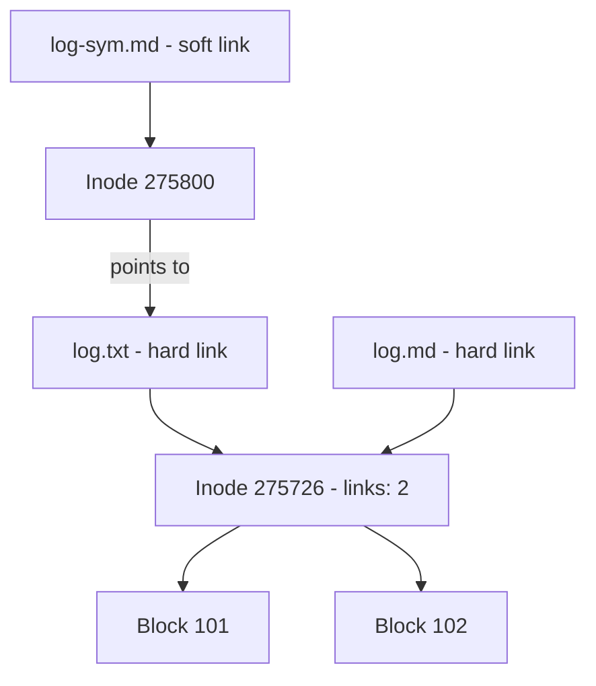

We use `ls` all the time on Unix systems to list files and directories. But have you ever stopped to think about where the information about these files is stored?

How does the system know who the owner is, what the permissions are, or where the content is on the disk?

And how is it possible to have two different names pointing to the same file?

The answer to all of this is the inode.

## What is an inode?

An inode is a data structure in Unix file systems. Each file has its own, and it is where metadata is stored: permissions, owner, size, timestamps, and so on.

But there is one detail that confuses a lot of people: the inode **does not** store the file name or content.

So where are these things stored?

The name is stored in the directory. A directory in Unix is basically a table that associates names with inode numbers.

The content is stored in blocks on the disk. The inode stores pointers to these blocks, and that is how the system is able to locate the data when you access the file.



To see this association between name and inode in practice, just use `ls -i1a`:

```bash
$: ls -i1a /home/caixeta
1377 .
1231 ..
1045350 notes.txt
```

Now that we know what the inode does not store, let's see what it actually stores. The `stat` command shows everything:

```bash
$: stat notes.txt
  File: notes.txt                                # ← file name
  Size: 244                                      # ← size in bytes
  Blocks: 8                                      # ← blocks used on disk
  IO Block: 4096                                 # ← I/O block size
  regular file                                   # ← file type
  Device: 8,1                                    # ← device where the file lives
  Inode: 1045350                                 # ← inode number
  Links: 1                                       # ← hard link count
  Access: (0664/-rw-rw-r--)                      # ← permissions
  Uid: ( 1000/ caixeta)                          # ← file owner
  Gid: ( 1001/ caixeta)                          # ← file group
  Access: 2026-02-26 16:25:23.439102644 +0000   # ← last access
  Modify: 2026-02-25 16:17:09.005162506 +0000   # ← last modification
  Change: 2026-02-25 16:17:09.006162510 +0000   # ← last metadata change
   Birth: 2026-02-25 16:17:09.005162506 +0000   # ← creation date
```

> The output above has been formatted for readability. On your terminal, the layout may be different.

Notice the `regular file` field. That is the file type. An inode can represent several types: directory, symbolic link, socket, block device, etc.

## Links

At the beginning I asked: how is it possible to have two different names pointing to the same file?

To understand that, we need to talk about links.

In the `stat` example, the file has `Links: 1`. That field represents the number of **hard links** pointing to the inode. This is the default. When you create a file, the system creates an entry in the directory pointing to the inode, and that entry already counts as a hard link.

### Hard links

A hard link is just another entry in the directory pointing to the same inode. It is not a copy, not a shortcut. It is literally another name for the same data on disk.

Let's see it in practice. First, we create a file:

```bash
$ touch log.txt
$ ls -i1l
275726 -rw-rw-r-- 1 caixeta caixeta 0 Feb 27 16:34 log.txt
```

Inode 275726, links: 1. Now we create a hard link:

```bash
$ ln log.txt log.md
$ ls -i1l
275726 -rw-rw-r-- 2 caixeta caixeta 0 Feb 27 16:34 log.md
275726 -rw-rw-r-- 2 caixeta caixeta 0 Feb 27 16:34 log.txt
```

Same inode, links went up to 2. `ln` did not create a new file. It just added another name for the same inode.

To prove the data is the same:

```bash
$ echo “hello” > log.txt
$ cat log.md
hello
```

We wrote to `log.txt` and the content showed up in `log.md`. They are the same file.



### Hard links in directories

Directories also have hard links, but only the system itself can create them. You cannot do it manually. When we create a directory, it is born with 2 links:

```bash
$ mkdir projects
$ ls -i1ld projects
280100 drwxrwxr-x 2 caixeta caixeta 4096 Feb 27 17:01 projects
```

Where do those 2 come from? The first is the `projects` entry in the parent directory. The second is the `.` inside the directory itself:

```bash
$ ls -i1a projects
280100 .
279900 ..
```

`.` has the same inode (280100). It is a hard link to itself. `..` points to the parent directory, so it does not count.

If we create a subdirectory inside `projects`, the counter goes up to 3:

```bash
$ mkdir projects/src
$ ls -i1ld projects
280100 drwxrwxr-x 3 caixeta caixeta 4096 Feb 27 17:02 projects
```

The third link comes from the `..` inside `projects/src`, which points back to `projects`.



### Soft links

Besides hard links, there is the **soft link** (or symbolic link). The difference is that it creates a new file, with its own inode, that only stores the path to the original file.

```bash
$ ln -s log.txt log-sym.md
$ ls -i1l
275726 -rw-rw-r-- 2 caixeta caixeta 6 Feb 27 16:34 log.md
275726 -rw-rw-r-- 2 caixeta caixeta 6 Feb 27 16:34 log.txt
275800 lrwxrwxrwx 1 caixeta caixeta 7 Feb 27 16:35 log-sym.md -> log.txt
```

Notice that `log-sym.md` has a different inode (275800) and the link count of `log.txt` stays at 2. The soft link is just a reference to the name. If you remove `log.txt`, the soft link breaks.



## What happens when you remove a file?

When you run `rm file.txt`, the system does not erase the content right away. What happens is that the directory entry is removed and the link count drops.

The inode and the data are only actually freed when:

- The link count reaches **0** (no name points to the inode)
- **No process** has the file open

So if there is still a hard link or some process using the file, the data stays on disk.

And how do you know if some process is still using a file? That is what `lsof` is for. If you want to understand how it works, I wrote a post about it: [Understanding the lsof command](/blog/lsof-command-tutorial).

## Conclusion

Inodes are the foundation of how Unix organizes files. The name lives in the directory, the metadata lives in the inode, and the content lives in blocks on disk.

This separation is what makes things like hard links possible, and it is why deleting a file does not necessarily erase the data. The system needs to make sure no one else depends on that inode.

If you want to explore this in your day to day, `ls -i`, `stat` and `lsof` are your best friends.


